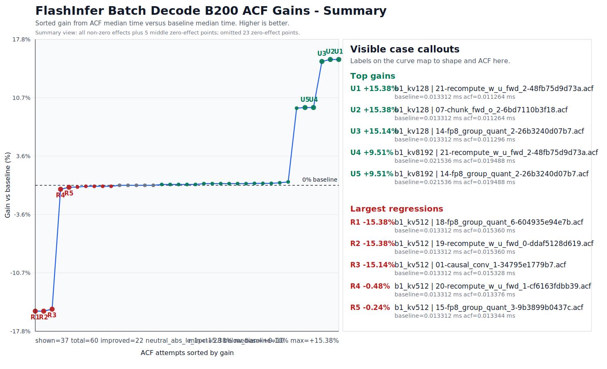

# Booster Packs

Booster Packs are GitHub Release zip files that contain curated Advanced Controls Files (ACFs) for specific workload families.

The goal is to give you a practical starting point. Instead of running a full CompileIQ search, first you can try curated candidates that are known to help specific workloads. If one of them passes validation and improves your target workload, you may choose not to run a search for that case.

> Note: Booster Packs are not guaranteed speedups. Treat every ACF as workload-specific and environment-specific.

## Choose the Right Path

| If this is true | Use this path |
|-----------------|---------------|
| Your workload is close to a Booster Pack's intended workload, compiler, GPU target, and validation context. | Try the Booster Pack first. |
| Your workload differs materially from the pack context, the pack candidates do not help, or you need production confidence for one exact target. | Run a full CompileIQ search. |
| You do not have a stable baseline, correctness check, compiler path, or benchmark setup yet. | Wait. Do not apply a pack or run a search until those are in place. |

## Before You Use a Pack

Before trying a Booster Pack, run a baseline without an ACF and record the environment you used for that baseline. Evaluate the variability of your benchmark; make sure to follow good profiling practices to avoid measurements with high variability.

Adapt your code to handle failures: Applying an ACF can cause compilation errors, compile hangs, runtime crashes, wrong answers, performance regressions, or noisy measurements. That is normal for this workflow. Keep the candidates that pass your validation and reject the rest.

For the broader ACF risk model, read the [compiler tuning overview](compilers_overview.md) before using a Booster Pack.

## Available Booster Packs

| Booster Pack | Intended use |
|--------------|--------------|
| Helion Booster Pack | ACFs known to help these Helion kernels: FP8 Quantization, Causal Depthwise Convolution, Gated DeltaNet Forward. |
| Debug Pack | Diagnostic ACFs that disable or alter selected optimizations to assist debugging. |

The pack name tells you where the ACFs were found or validated. It is not a hard boundary. Related workloads may benefit, but you must test them.

For example, the Helion Booster Pack has shown beneficial impact on FlashInfer's `BatchDecodeWithPagedKVCacheWrapper` benchmark.

## Downloading a Booster Pack

Booster Packs will be published as zip assets on the [CompileIQ GitHub Releases page](https://github.com/NVIDIA/CompileIQ/releases) under a Booster Pack catalog release, tagged with a Booster Pack-specific prefix, for example `booster-packs-*`.


* Each Booster Pack catalog release will contain the complete set of Booster Pack zip assets that are currently supported for that catalog version, so users can go to one release to find every supported pack.
* Each Booster Pack catalog release will include a top-level `booster-pack-catalog.json` that describes those release contents.
* Each Booster Pack zip consists of ACFs and a pack-specific `booster-pack-manifest.json` that describes the ACFs for that pack.


Until those assets are published, treat these as proposed asset names:
* `helion-booster-pack.zip`
* `debug-pack.zip`


Each Booster Pack zip should include a pack-specific manifest file, for example `booster-pack-manifest.json`. The release notes, catalog file, and pack manifest are the source of truth for each pack; check them for the intended workload, compiler version and path or compiler stage, GPU target, validation context, and known caveats.

## Using a Booster Pack

The basic workflow is:

1. Run your workload without an ACF and save the baseline result.
2. Download the Booster Pack from GitHub Releases.
3. Unzip the pack.
4. Apply one ACF at a time through the Controls Interface.
5. Validate correctness against a known-good reference.
6. Compare performance against the no-ACF baseline.
7. Keep only candidates that compile, pass correctness, and improve the target workload.

For direct PTXAS usage, pass the ACF with `--apply-controls`:

```bash
ptxas -v -arch=sm_90a --apply-controls candidate.acf kernel.ptx
```

For NVCC usage, pass the same option to NVCC:

```bash
nvcc -arch=sm_100 --apply-controls candidate.acf kernel.cu -o kernel
```

For Triton, pass the ACF through PTXAS options as shown in the [Triton example](triton_example.md). Make sure you force recompilation where framework caching applies, such as with `TRITON_ALWAYS_COMPILE`.

For Helion, pass the ACF through the official ACF API as shown in the [Softmax Example](https://helionlang.com/examples/acfs/softmax_acf.html). Make sure you force recompilation where framework caching applies.

## Trying Related Workloads

ACFs rarely generalize automatically, but related workloads can sometimes benefit from the same compiler decisions.

If your workload is similar to the workload described in a Booster Pack release, it may be worth testing that pack before running a full search. The safe way to do this is still candidate-by-candidate validation:

* Apply one ACF at a time.
* Test multiple input shapes where applicable.
* Compare against a known-good implementation.
* Use compile and runtime timeouts.
* Run multiple performance trials if the benchmark is noisy.
* Record the ACF name, command, compiler path/version, CTK, driver, GPU model, workload shape, and result.

As an example we have applied the Helion Booster Pack to Batch Decode in FlashInfer and we can see that some shapes get considerable benefits from some of the ACFs in the pack:

<figure>
  
  <figcaption>Summary of FlashInfer Batch Decode results across ACF candidates.</figcaption>
</figure>

For a FlashInfer-specific walkthrough, see [Applying a Booster Pack to FlashInfer](flashinfer_booster.md).

> There is no guarantee that ACFs will always provide benefits. We encourage you to validate performance and remain using the default compiler profiles when beneficial.

## When to Run a Search Instead

Run your own CompileIQ search if:

* None of the Booster Pack candidates help your workload.
* Your GPU, CTK, compiler, framework, or workload shape differs materially from the release notes.
* You need stronger confidence for a specific production workload.
* You want to co-tune compiler controls with application-level parameters.

Booster Packs are a shortcut when a curated candidate works. They do not replace workload-specific search and validation.
