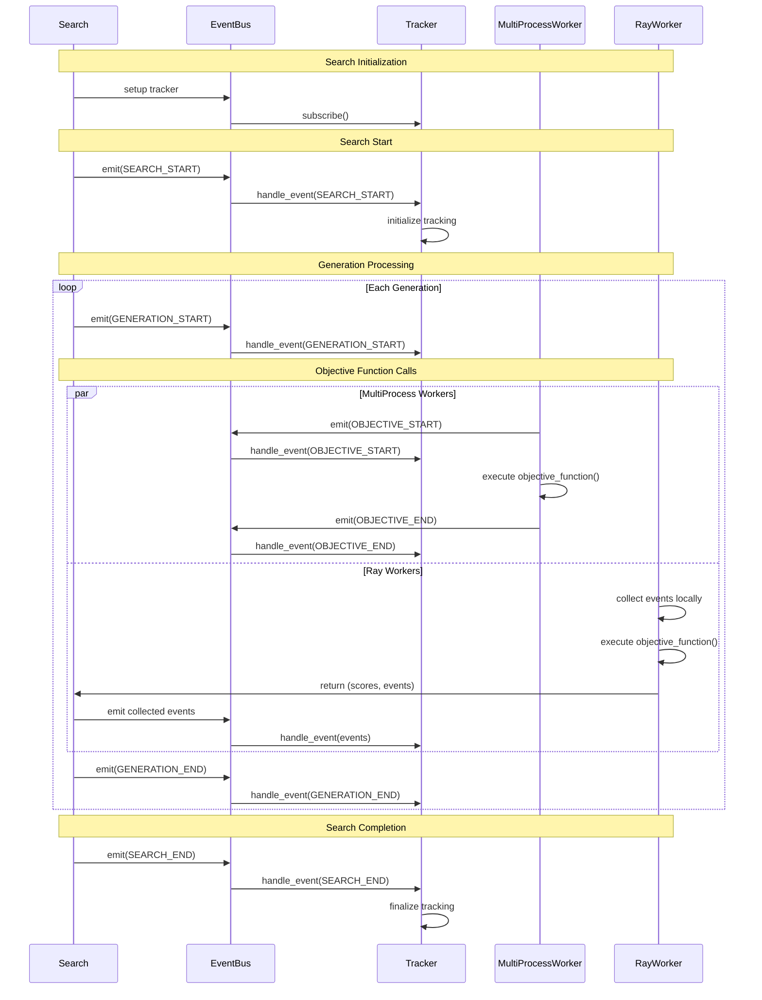

# Experiment Tracking with CompileIQ

CompileIQ provides comprehensive facilities for tracking your experiments through an event-driven architecture. Experiment tracking, also known as logging, is an invaluable tool that provides insight into your searches, allowing you to monitor progress, debug issues, and analyze performance patterns.

## How Tracking Works

CompileIQ uses an event-driven tracking system that captures important moments during your search process. Events are automatically generated at key points and processed by your chosen tracking backend. This design allows for:

- **Real-time monitoring** of your search progress
- **Distributed tracking** across multiple workers and nodes
- **Rich contextual information** including worker types, node IDs, and performance metrics

## Tracker Events

CompileIQ automatically generates tracking events at these key moments in your search lifecycle:

### Search Lifecycle Events

- **Search starts**: When `.start()` is called, includes run metadata
- **Search ends**: When the search completes or is terminated
- **Generation starts**: At the beginning of each new generation
- **Generation ends**: When all evaluations in a generation complete

### Objective Function Events  

- **Pre-objective**: Before each objective function call, includes parameter configuration
- **Post-objective**: After each objective function call, includes scores and execution metadata

## Tracker Types

You select the tracker used during the search by means of defining a `TrackerConfig` object, and then passing this as the `tracker_config` parameter to the `Search` constructor.

The next sections will guide you on configuring each of the different trackers available.

### Tracking with Loguru (Logger)

[Loguru](https://loguru.readthedocs.io/en/stable/) is a Python logging library that provides structured logging to files. This is the default tracker and requires no additional setup.

```python
from compileiq.ciq import Search
from compileiq.types import LoguruTrackerConfig

# Using default tracker (Loguru)
tuner = Search(
    objective_function=objective,
    search_space=search_space_config,
    search_config=main_config,
    tracker_config=TrackerTypes.LOGURU
)

# Explicit Loguru tracker
tuner = Search(
    objective_function=objective,
    search_space=search_space_config,
    search_config=main_config,
    tracker_config=LoguruTrackerConfig(sink="search.log"),
)
```

> `LoguruTrackerConfig` will accept any parameter passed into logger, such `level`, `format` and others. You can also pass in a list to `sink` so we both output to `stdout` as well as a file for example.

In the example above, Loguru tracker creates a `search.log` file in your current directory with structured log entries:

```bash
2025-07-07 16:41:09.118 | INFO     | compileiq.tracker:__init__:77 - LoguruTracker initialized with file=search.log, kwargs={}
2025-07-07 16:41:10.795 | INFO     | compileiq.tracker:search_starts:86 - Search started
2025-07-07 16:41:10.796 | DEBUG    | compileiq.tracker:search_starts:87 - Other kwargs: {}
2025-07-07 16:41:10.824 | INFO     | compileiq.tracker:generation_starts:95 - ================================================
2025-07-07 16:41:10.824 | INFO     | compileiq.tracker:generation_starts:96 - Generation 0 started
2025-07-07 16:41:10.824 | DEBUG    | compileiq.tracker:generation_starts:97 - Other kwargs: {}
2025-07-07 16:41:10.828 | INFO     | compileiq.tracker:pre_objective:105 - Executing objective function with: {'x': 12.5, 'y': 3}
2025-07-07 16:41:10.828 | DEBUG    | compileiq.tracker:pre_objective:106 - Other kwargs before running the objective function: {}
2025-07-07 16:41:10.828 | INFO     | compileiq.tracker:post_objective:109 - Scored: [159.25]
2025-07-07 16:41:10.828 | DEBUG    | compileiq.tracker:post_objective:110 - Other kwargs after running the objective function: {}
```

### Tracking with MLflow

[MLflow](https://mlflow.org/docs/latest/ml/) is a popular ML experiment tracking platform.

> This is an optional dependency and can be installed with `pip install compileiq[tracking]`

```python
from compileiq.ciq import Search
from compileiq.types import MLflowTrackerConfig

# The config will be logged as an artifact, by default.
# This can be disabled by setting log_config=False in the tracker config.
tracker_config = MLflowTrackerConfig(
    experiment_name="test",
    tracking_uri="<mlflow_url>",
    description="Test run in CompileIQ",
)

main_config = SearchConfiguration(
    pool_size=32,
    generations=3,
    mutate_rate=0.5,
    problem_type="min",
    num_objectives=1,
)
```

The MLflow tracker automatically logs:

- **Parameters**: Each parameter configuration tested
- **Metrics**: Objective function scores
- **Artifacts**: Search configuration file
- **Tags**: Worker type, node information, and search metadata

#### Artifacts

MLflow supports logging a variety of objects as artifacts, including:

- files (by path), directories
- JSON/YAML-serializable dictionaries
- Pandas DataFrames (as CSV)
- Numpy arrays (as .npy)
- Matplotlib and Plotly figures (as images), images (as numpy arrays, PIL images, or mlflow.Image), and text.

You are allowed to use all of the MlFlow tracking facilities inside of the objective function. Elements tracked here will be stored in the run being used by the evaluation.

```python
from mlflow import trace, log_artifact, set_tag

def objective(config):
    ...
        # Also to keep track of the config
    if "z" in config.keys():
        set_tag("z", "present")
    else:
        set_tag("z", "not present")
    ...

    with tempfile.TemporaryDirectory() as temp_dir:
        temp_file = os.path.join(temp_dir, "sample.acf")
        # Use the trace decorator to trace any function calls
        save_compiler_config(config, temp_file)
        log_artifact(temp_file)
```

#### Function Tracing

Function Tracing (a.k.a. [Tracing](https://mlflow.org/docs/latest/genai/tracing/)) is an MLflow feature that allows recording the input parameters and return values of functions. This is specially useful for profiling and debugging. When exceptions are raised the stack trace is also displayed nicely in the MLflow UI. MLflow Function Tracing is optional, and can be activated by using the `mlflow.trace` decorator:

```python
from mlflow import trace

def secondary_function(config):
    # Do something cool!
    pass

@trace
def objective(config):
    ...
    trace(secondary_function)(config)
```

## Worker-Specific Tracking

CompileIQ's event-driven architecture automatically adapts to different worker types, providing relevant contextual information:

### MultiProcess Workers

- **Process ID**: Identifies which process executed the objective function
- **Process-level metrics**: Memory usage, execution time per process
- **Local file logging**: All events logged to local files

### Ray Workers  

- **Node ID**: Identifies which Ray cluster node executed the function
- **Distributed metrics**: Cross-node performance comparison
- **Remote event collection**: Events collected from remote nodes and aggregated

## Troubleshooting

### Common Issues

**Log files not created**: Ensure you have write permissions in the current directory.

**Ray workers not tracking**: Verify that the Ray cluster is properly configured and that remote nodes can communicate with the tracking backend.

**MLflow connection errors**: Check network connectivity to the MLflow server and verify authentication credentials.

### Debug Mode

Enable debug mode for more verbose tracking information:

```python
tuner = Search(
    # ... your configuration ...
    debug=True,
)
```

This will provide additional diagnostic information in your tracking outputs.

## Defining your own tracker

CompileIQ's experiment tracking system uses an event-driven architecture that allows developers to implement custom tracking backends. This section explains how to create your own tracker implementations.

### Architecture Overview

CompileIQ's tracking system is built on top of a single `BaseTracker` class that tracker classes must implement.

### Event Timeline

The following diagram shows the sequence of events during a typical CompileIQ search:



### Implementing a Custom Tracker

To create a custom tracker, inherit from `BaseTracker` and implement the required methods:

### Registering Custom Trackers

To use your custom tracker, you'll need to extend the tracker factory in CompileIQ:

```python
# Add to TrackerTypes enum
class TrackerTypes(Enum):
    LOGURU = "loguru"
    MLFLOW = "mlflow"
    CUSTOM = "custom"

# Modify Search to support custom trackers
class Search(BaseModel):
    tracker_type: TrackerTypes = TrackerTypes.DEFAULT
    custom_tracker: Optional[BaseTracker] = None
    
    def _setup(self):
        # ... existing setup ...
        
        match self.tracker_type:
            case TrackerTypes.LOGURU:
                tracker = LoguruTracker()
            case TrackerTypes.MLFLOW:
                tracker = MLflowTracker()
            case TrackerTypes.CUSTOM:
                if self.custom_tracker is None:
                    raise ValueError("custom_tracker must be provided when using TrackerTypes.CUSTOM")
                tracker = self.custom_tracker
        
        self._event_bus.subscribe(tracker)
```

### Best Practices for Custom Trackers

1. **Error Handling**: Always handle exceptions gracefully. Tracker errors should not break the main search process.

2. **Resource Management**: Properly implement `setup()` and `cleanup()` methods for resource management.

3. **Distributed Considerations**: Your tracker should handle scenarios where workers don't run in the same machine as the host.
