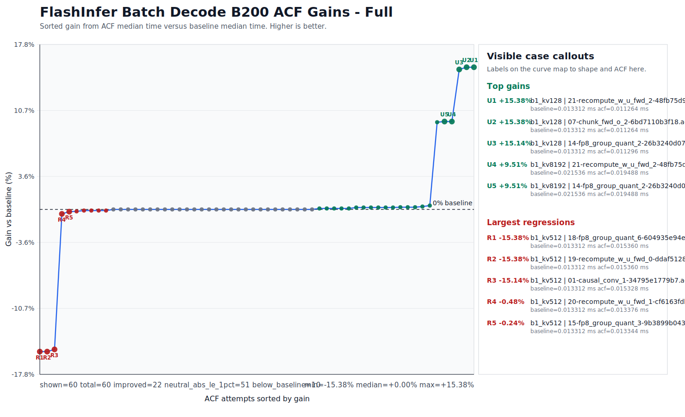

# Applying a Booster Pack to FlashInfer

This page shows how to try the Helion Booster Pack on FlashInfer's `BatchDecodeWithPagedKVCacheWrapper` benchmark.

The Booster Pack contains pre-made Advanced Controls Files (ACFs). Each ACF changes compiler decisions through the NVIDIA Controls Interface, without changing the FlashInfer source code. Even though this Booster Pack was generated using Helion kernels, some cases of FlashInfer do benefit from the same ACFs.

> Booster Packs are not a replacement for validation. ACFs can cause compilation errors, hangs, crashes, wrong answers, regressions, or noisy measurements.

## Prerequisites

Use an environment that matches the Booster Pack release notes and manifest. At minimum, check:

* GPU model and compute capability.
* CUDA Toolkit version.
* `nvcc` and `ptxas` paths.
* FlashInfer version or source checkout.
* Benchmark command and input shape.

For this workflow, use CTK 13.3 or newer so `nvcc` and `ptxas` support the Controls Interface.

```bash
export CUDA_HOME=/path/to/cuda
export CUDA_PATH="$CUDA_HOME"
export FLASHINFER_NVCC="$CUDA_HOME/bin/nvcc"
export FLASHINFER_CUDA_ARCH_LIST=10.0a
export FLASHINFER_NO_DOWNLOAD=1
export PATH="$CUDA_HOME/bin:$PATH"
```

Verify the compiler paths before running the benchmark:

```bash
"$FLASHINFER_NVCC" --version
"$CUDA_HOME/bin/ptxas" --version
"$CUDA_HOME/bin/ptxas" --help | grep apply-controls
```

If your toolkit, GPU, or FlashInfer setup differs from the release notes, you can still test the pack, but treat the result as a new validation target.

## Use Source FlashInfer

Use a FlashInfer source checkout or an editable install so the benchmark compiles kernels in your current environment. Avoid prebuilt kernel caches when evaluating ACFs.

Confirm which FlashInfer package Python imports:

```bash
python - <<'PY'
import flashinfer
print(flashinfer.__file__)
PY
```

If your environment includes prebuilt FlashInfer cache packages, make sure they are not being used for this experiment:

```bash
python - <<'PY'
import importlib.util
for name in ["flashinfer_cubin", "flashinfer_jit_cache"]:
    spec = importlib.util.find_spec(name)
    print(name, spec)
    if spec is not None:
      raise RuntimeError(f"Package {name} is present in the environment. Please remove it before proceeding.")
PY
```

For a clean ACF test, both cache package checks should print `None`.

## Download the Pack

Download the Helion booster pack `.zip` from the most recent booster pack release in the [CompileIQ GitHub Releases page](https://github.com/NVIDIA/CompileIQ/releases), then unzip it into your workspace.

```bash
unzip helion-booster-pack.zip -d helion-booster-pack
```

Read the manifest before running the candidates. The manifest and release notes are the source of truth for the intended workload, compiler version, GPU target, validation context, and known caveats.

## Run a Baseline

Run the benchmark once without an ACF. Save the command, environment, and result; this is the number every candidate must beat.

```bash
unset FLASHINFER_EXTRA_CUDAFLAGS

python benchmarks/flashinfer_benchmark.py \
  --routine BatchDecodeWithPagedKVCacheWrapper \
  --backends fa2 \
  --page_size 16 \
  --batch_size 1 \
  --s_qo 1 \
  --s_kv 128 \
  --num_qo_heads 8 \
  --num_kv_heads 8 \
  --head_dim_qk 128 \
  --head_dim_vo 128 \
  --q_dtype bfloat16
```

If your benchmark has meaningful variability, run several trials and compare candidates against the aggregate baseline instead of a single run.

## Apply One ACF

Choose one ACF from the unzipped pack and pass it to PTXAS through NVCC:

```bash
export ACF_FILE=/path/to/helion-booster-pack/candidate.acf
export FLASHINFER_EXTRA_CUDAFLAGS="--ptxas-options=--apply-controls=$ACF_FILE"

python benchmarks/flashinfer_benchmark.py \
  --routine BatchDecodeWithPagedKVCacheWrapper \
  --backends fa2 \
  --page_size 16 \
  --batch_size 1 \
  --s_qo 1 \
  --s_kv 128 \
  --num_qo_heads 8 \
  --num_kv_heads 8 \
  --head_dim_qk 128 \
  --head_dim_vo 128 \
  --q_dtype bfloat16
```

Apply only one ACF per run. If the benchmark fails to compile, hangs, crashes, returns wrong answers, or regresses, reject that candidate and move to the next one.

## Force Recompilation

Framework and benchmark caches can hide whether an ACF was actually applied. Use a fresh workspace or clear the relevant cache before each candidate.

For FlashInfer experiments, make sure the benchmark recompiles kernels after changing `FLASHINFER_EXTRA_CUDAFLAGS`. If you cannot prove recompilation happened, do not trust the measurement.

## Validate the Result

Treat correctness validation as part of the benchmark workflow. Compare each candidate against a known-good reference, and test multiple input shapes when those shapes matter for your workload.

Record enough information to reproduce the result:

* ACF filename.
* Manifest and release version.
* Benchmark command.
* GPU model and driver.
* CTK version.
* `nvcc` and `ptxas` paths and versions.
* FlashInfer version or commit.
* Input shape.
* Baseline result.
* Candidate result.
* Correctness status.

Keep the ACF only if it compiles, passes correctness checks, and improves the no-ACF baseline.

## Results

Below we show comprehensive results for different cases of `BatchDecodeWithPagedKVCacheWrapper`. This data was generated on a B200 machine.

<figure>
  
  <figcaption>FlashInfer <code>BatchDecodeWithPagedKVCacheWrapper</code> results across ACF candidates.</figcaption>
</figure>
